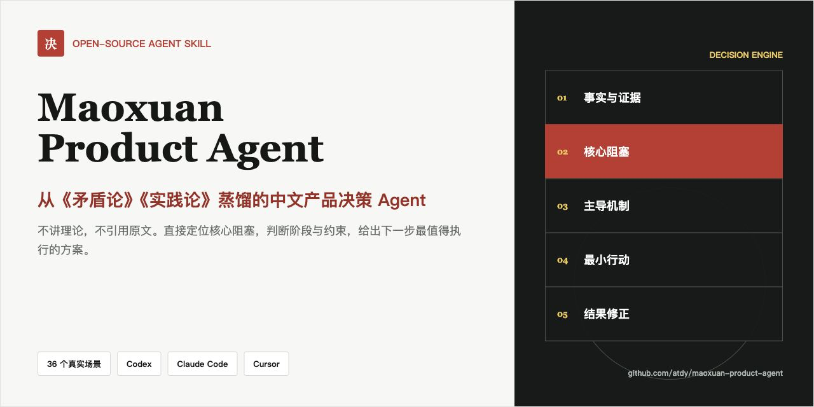

# Maoxuan Product Agent

### 从《矛盾论》《实践论》蒸馏出来的中文产品工作 Agent

[在线介绍](https://atdy.github.io/maoxuan-product-agent/) · [12 个决策案例](https://atdy.github.io/maoxuan-product-agent/cases/) · [skills.sh](https://www.skills.sh/atdy/maoxuan-product-agent/product-decision-agent) · [Agent Skills](https://agent-skills.md/skills/atdy/maoxuan-product-agent/product-decision-agent) · [Skillstore](https://skillstore.io/skills/atdy-product-decision-agent) · [English](README_EN.md) · [安装](#安装) · [回答示例](#回答长什么样) · [设计审计](evaluation/source_reading_audit.md)

> 复杂的产品问题，通常不是没有办法，而是没有找到当前最该解决的那个问题。

这是一个面向中国大陆互联网工作场景的产品决策 Agent。

它以对《矛盾论》《实践论》的完整阅读为底座，不摘抄语录，也不把几句话包装成框架，而是把两篇文章的完整推理结构蒸馏成 Agent 的后台决策过程：从真实材料出发，找到当前阶段的核心阻塞，判断什么机制正在主导结果，再用最小行动回到实践中验证和修正。

用户不会看到哲学课、历史课或政治化表达。你只需要把真实问题交给它：

~~~text
老板临时插了一个积分商城，但这个版本原本在做新手转化，我该怎么处理？
~~~

它会直接告诉你：

- 这件事真正冲突的是什么。
- 当前应该保护哪个业务结果。
- 下一步找谁、做什么、何时完成。
- 用什么信号决定继续、停止或回滚。
- 哪些事情现在不要做。

**它的来源是《矛盾论》《实践论》，它的工作语言是现代互联网产品。**

### 30 秒开始

一条命令安装到 Codex、Claude Code 和 Cursor：

~~~bash
npx skills add atdy/maoxuan-product-agent --skill product-decision-agent --agent codex claude-code cursor -g -y
~~~

然后直接说真实问题：

~~~text
使用 product-decision-agent 帮我判断：A/B Test 点击率涨了 12%，但订单没涨，要不要全量？
~~~

安装命令已经在隔离环境中做过端到端验证。也可以继续使用仓库自带的 [安装脚本](#一键安装) 或手动安装。

项目已被 [skills.sh](https://www.skills.sh/atdy/maoxuan-product-agent/product-decision-agent)、[Agent Skills](https://agent-skills.md/skills/atdy/maoxuan-product-agent/product-decision-agent)、安全审计通过且质量评分 83/100 的 [Skillstore](https://skillstore.io/skills/atdy-product-decision-agent)，以及 4.2 万 Star 的 [Agentic Awesome Skills](https://github.com/sickn33/agentic-awesome-skills/tree/main/skills/product-decision-agent) 独立收录；四个目录均回链到本仓库，可直接核对来源与安全信息。

## 它不是什么

- 不是《毛选》问答库。
- 不是语录生成器。
- 不是历史或政治研究工具。
- 不是把“主要矛盾”“实践出真知”挂在嘴边的角色扮演。
- 不是套模板后平均罗列十种方案的通用产品 Prompt。

默认回答不会出现“《矛盾论》认为”“《实践论》指出”“毛主席说”等表达。方法在后台，答案只解决工作问题。

## 为什么值得用

普通产品 Prompt 容易给出一组看起来都对的建议。这个 Agent 强制完成几项更困难的判断：

| 常见回答 | Maoxuan Product Agent |
|---|---|
| 罗列所有可能方向 | 找当前阶段最影响结果的核心阻塞 |
| 套行业最佳实践 | 先核对人群、阶段、资源和前提 |
| 把数据或反馈直接当结论 | 区分事实、假设、二手判断和孤立个案 |
| 找到问题就开始给方案 | 继续判断什么机制正在主导结果 |
| 给一个完整大方案 | 证据不足时先做最小诊断或可回滚验证 |
| 只说应该做什么 | 同时给停止清单和切换打法的条件 |

它的后台决策闭环是：

~~~mermaid
flowchart LR
    A["真实产品问题"] --> B["区分事实与假设"]
    B --> C["定位核心阻塞"]
    C --> D["判断主导机制与阶段"]
    D --> E["选择最小有效行动"]
    E --> F["用真实结果验证"]
    F --> B
~~~

## 方法是怎样被蒸馏的

设计阶段完整阅读了《实践论》《矛盾论》，并通读《毛泽东选集》第一卷中与调查研究、阶段判断、资源集中、组织方法和行动验证相关的篇目。

这里保留的不是原文措辞，而是判断动作：

| 方法来源中的结构 | 产品工作中的动作 |
|---|---|
| 从实践形成认识 | 从用户行为、数据、一线材料形成机制判断 |
| 认识回到实践检验 | MVP、灰度、A/B Test、用户验证、数据验证 |
| 区分现象与内部机制 | 不把 DAU 下滑直接处理成“做活动” |
| 找当前阶段的主要问题 | 找到最影响结果、解除后能带动其他问题的阻塞 |
| 判断哪一方当前起主导作用 | 区分供给/需求、价值/摩擦、流量/承接、目标/激励 |
| 具体问题具体分析 | 按人群、阶段、渠道、链路和约束选择打法 |
| 条件变化带来关系变化 | 写清何时加码、停止、回滚或切换策略 |
| 不同性质的问题用不同方法 | 数据冲突查口径，资源冲突做取舍，假设冲突用实验 |

完整阅读范围和转译审查记录见 [source_reading_audit.md](evaluation/source_reading_audit.md) 与 [methodology-basis.md](product-decision-agent/references/methodology-basis.md)。

## 回答长什么样

默认结构很简单：

1. **问题判断**：一句话指出真正问题。
2. **原因分析**：解释为什么这是当前关键。
3. **行动建议**：给出 1-3 个动作，包含时间、相关方、指标或决策口径。
4. **风险提醒**：明确现在不要做什么。
5. **需要确认**：只在会改变判断时出现，最多 3 个问题。

示例：

~~~text
用户：
社区 DAU 连续两周下降 15%，运营想加活动拉回来。

Agent：
问题判断
先不要做活动，当前最关键的是确认下滑来自哪类用户和哪个环节。

原因分析
- 连续两周下降已经不像普通波动。
- 新用户、老用户、内容供给、分发、版本和 Push 都可能造成同一现象。
- 没拆来源就上活动，只会制造短期噪音。

行动建议
1. 24 小时内按新老用户、渠道、平台、版本和内容供给拆下降贡献。
2. 找贡献最大的 1-2 个群体，核对行为路径和一线反馈。
3. 内容供给导致下滑，就先修复核心创作者留存；渠道导致下滑，再决定是否做拉新。

风险提醒
不要先上全站活动，也不要只看总 DAU 做判断。
~~~

### 直接看 12 个真实决策案例

- **需求与项目**：[老板临时插需求](https://atdy.github.io/maoxuan-product-agent/cases/boss-insert-request.html) · [20 个需求怎么排优先级](https://atdy.github.io/maoxuan-product-agent/cases/requirement-prioritization.html) · [项目延期两周](https://atdy.github.io/maoxuan-product-agent/cases/project-delay.html)
- **增长与实验**：[增长停滞](https://atdy.github.io/maoxuan-product-agent/cases/growth-stagnation.html) · [DAU 连续下滑](https://atdy.github.io/maoxuan-product-agent/cases/dau-decline.html) · [新版本后留存下降](https://atdy.github.io/maoxuan-product-agent/cases/retention-drop-after-release.html) · [A/B Test 点击涨但订单不涨](https://atdy.github.io/maoxuan-product-agent/cases/ab-test-clicks-no-orders.html)
- **运营与供给**：[社区冷启动](https://atdy.github.io/maoxuan-product-agent/cases/community-cold-start.html) · [内容供给不足](https://atdy.github.io/maoxuan-product-agent/cases/content-supply-shortage.html) · [活动参与率低](https://atdy.github.io/maoxuan-product-agent/cases/campaign-low-participation.html)
- **数据与用户**：[数据口径不一致](https://atdy.github.io/maoxuan-product-agent/cases/data-definition-conflict.html) · [用户反馈互相矛盾](https://atdy.github.io/maoxuan-product-agent/cases/conflicting-user-feedback.html)

每个页面都给出问题判断、行动顺序、停止项和切换条件。完整入口见 [产品决策案例库](https://atdy.github.io/maoxuan-product-agent/cases/)。

## 适合谁

- 产品经理、产品负责人、产品运营。
- 增长、用户、内容、社区、活动运营。
- 创业团队、业务负责人、项目负责人。
- 需要处理数据异常、资源冲突和跨部门协作的人。

覆盖 36 类日常场景，包括需求优先级、版本规划、Roadmap、增长停滞、DAU/留存/转化、活动、社区冷启动、内容供给、竞品、A/B Test、数据口径、老板插需求、项目延期、资源协调、OKR/KPI 和复盘。

## 安装

仓库中的标准 Skill 包是 <code>product-decision-agent/</code>。它遵循 Agent Skills 目录结构，可以同时用于 Codex、Claude Code、Cursor 和其他兼容 Agent。

### 通用安装器（推荐）

通过 Vercel 的开源 Agent Skills CLI，一次安装到 Codex、Claude Code 和 Cursor：

~~~bash
npx skills add atdy/maoxuan-product-agent --skill product-decision-agent --agent codex claude-code cursor -g -y
~~~

只查看仓库中可安装的 Skill，不写入本机：

~~~bash
npx skills add atdy/maoxuan-product-agent --list
~~~

### 一键安装

先克隆仓库：

~~~bash
git clone https://github.com/atdy/maoxuan-product-agent.git
cd maoxuan-product-agent
~~~

然后运行：

~~~bash
# 安装到当前用户的 Codex
./scripts/install.sh codex

# 安装到当前用户的 Claude Code
./scripts/install.sh claude

# 安装到当前用户的 Cursor
./scripts/install.sh cursor

# 安装到通用 Agent Skills 目录（与 Codex 使用同一路径）
./scripts/install.sh agents
~~~

安装到某个项目，而不是全局：

~~~bash
./scripts/install.sh codex /path/to/project
./scripts/install.sh claude /path/to/project
./scripts/install.sh cursor /path/to/project
./scripts/install.sh agents /path/to/project
~~~

### 手动安装

| Agent | 用户级目录 | 项目级目录 | 显式调用 |
|---|---|---|---|
| Codex | <code>~/.agents/skills/product-decision-agent/</code> | <code>.agents/skills/product-decision-agent/</code> | <code>$product-decision-agent</code> |
| Claude Code | <code>~/.claude/skills/product-decision-agent/</code> | <code>.claude/skills/product-decision-agent/</code> | <code>/product-decision-agent</code> |
| Cursor | <code>~/.cursor/skills/product-decision-agent/</code> | <code>.cursor/skills/product-decision-agent/</code> | <code>/product-decision-agent</code> |
| Agent Skills 兼容工具 | <code>~/.agents/skills/product-decision-agent/</code> | <code>.agents/skills/product-decision-agent/</code> | 由具体 Agent 决定 |

手动复制示例：

~~~bash
mkdir -p ~/.claude/skills/product-decision-agent
cp -R product-decision-agent/. ~/.claude/skills/product-decision-agent/
~~~

Cursor 也会读取 <code>.agents/skills/</code>、<code>.claude/skills/</code> 和 <code>.codex/skills/</code>。因此执行一次 <code>./scripts/install.sh codex</code>，通常就能同时供 Codex 和 Cursor 使用；Claude Code 仍建议安装到自己的目录。

## 使用

安装后可以直接描述问题，Agent 会根据触发描述自动判断是否调用。也可以显式调用：

Codex：

~~~text
使用 $product-decision-agent 帮我判断：A/B Test 点击率涨了 12%，但订单没涨，要不要全量？
~~~

Claude Code 或 Cursor：

~~~text
/product-decision-agent 我们有 20 个需求抢两个研发，下一版该怎么排？
~~~

通用 Agent：

~~~text
请按 product-decision-agent 的规则诊断：版本延期两周，产品和研发互相认为是对方的问题。
~~~

你不需要在问题里提《毛选》《矛盾论》或《实践论》。真实的产品、运营、增长、数据或协作问题就是触发入口。

## 项目结构

~~~text
.
├── product-decision-agent/        # 可直接安装的标准 Skill 包
│   ├── SKILL.md                   # 触发、后台推理、输出规则
│   ├── agents/openai.yaml         # Codex UI 元数据
│   ├── references/
│   │   ├── methodology-basis.md   # 方法来源与产品化映射
│   │   ├── reasoning-engine.md    # 复杂问题推理引擎
│   │   ├── product-playbooks.md   # 36 个产品工作场景
│   │   └── response-examples.md   # 中文回答样例
│   └── scripts/
│       ├── quality_gate.py        # 输出质量门禁
│       └── test_quality_gate.py   # 门禁回归测试
├── evaluation/                    # 36 案例测试与代表性输出
├── docs/                          # GitHub Pages、SEO/GEO 与品牌资产
├── design/brand-assets.html       # 三张品牌图的可维护视觉源
├── scripts/
│   ├── install.sh                 # 多 Agent 安装脚本
│   ├── check_publication.py       # 页面、元数据、链接和图片门禁
│   └── validate.sh                # 项目级验证入口
├── .github/workflows/validate.yml # GitHub Actions
├── README_EN.md                   # 英文搜索入口
├── CHANGELOG.md
├── CITATION.cff
├── CONTRIBUTING.md
└── LICENSE
~~~

## 验证

运行完整本地验证：

~~~bash
./scripts/validate.sh
~~~

它会检查：

- 质量门禁本身的回归测试。
- 代表性正确答案全部通过。
- 故意包含来源暴露和空话的错误答案必须失败。
- 自测报告至少保留 36 个通过案例。
- GitHub Pages 的 SEO/GEO 元数据、本地链接和图片尺寸正确。

如果本机有 Codex 的 <code>skill-creator</code>：

~~~bash
python3 ~/.codex/skills/.system/skill-creator/scripts/quick_validate.py product-decision-agent
~~~

当前测试资产见 [self_test_report.md](evaluation/self_test_report.md) 和 [forward_test_report.md](evaluation/forward_test_report.md)。贡献规范见 [CONTRIBUTING.md](CONTRIBUTING.md)。

如果它确实帮你做出了一个更清楚的产品决策，可以给仓库一个 [Star](https://github.com/atdy/maoxuan-product-agent)。这会让更多中文产品同学更容易找到它。

## 设计边界

- 默认中文，保留 DAU、GMV、CAC、LTV、ROI、MVP、A/B Test 等必要缩写。
- 默认不引用原文、不解释哲学、不讲历史、不进行人物角色扮演。
- 信息足够就行动；信息不足先给条件判断和最小验证，不把所有问题抛回用户。
- 不承诺替代用户研究、数据核验、法务判断或最终业务责任。
- 用户明确要求追溯方法来源时，才读取维护文档并说明映射。

## 致谢

本项目在研究、对照和设计阶段参考并受益于以下开源项目。感谢所有作者和维护者：

- [leezythu/maoxuan-skill](https://github.com/leezythu/maoxuan-skill)
- [zhangtianruiwork-droid/Maoxuan-Changzheng](https://github.com/zhangtianruiwork-droid/Maoxuan-Changzheng)
- [weiyinfu/MaoZeDongAnthology](https://github.com/weiyinfu/MaoZeDongAnthology)

本项目没有复制上述项目的 Skill Prompt 或应用代码。它重新面向现代互联网产品工作设计，并刻意把原文、身份扮演和历史表达留在用户可见输出之外。

## License

[MIT License](LICENSE)

本仓库不包含《毛泽东选集》全文，不提供原文检索能力，也不作为政治、历史或哲学知识库使用。
